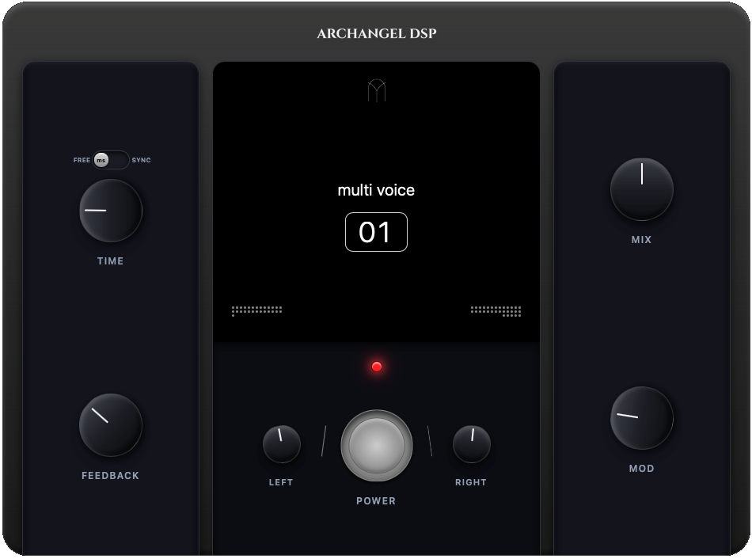

<p align="center">
  
</p>

<h1 align="center">Arcadia Voices</h1>

<p align="center">
  <b>Stereo Pitch-Shifting Delay Audio Plugin</b><br>
  Developed by <b>Archangel DSP</b>
</p>

<p align="center">
  <a href="https://github.com/sponsors/jfachriz">
    
  </a>
</p>

---

## Overview

**Arcadia Voices** is a stereo pitch-shifting delay plugin where left and right channels can be independently transposed. It combines delay processing with pitch transposition, chorus modulation, and tempo synchronization.

---

## Features

- **Dual Channel Pitch Shifting**: Independent semitone adjustment for left (-24 to +24) and right (-24 to +24) channels.
- **Tempo Synchronization**: Lock delay times to host DAW BPM with note divisions (1/32 to 2 bars).
- **Chorus Modulation**: Add pitch wobble and chorus width to delay repeats.
- **Preset System**: Factory presets and user preset save/recall functionality.
- **True Bypass**: Pristine signal bypass when powered off.

---

## Controls and Parameters

| Control | Range | Description |
| :--- | :--- | :--- |
| **TIME** | 1ms - 2000ms | Base delay time |
| **FEEDBACK** | 0% - 110% | Repeat regeneration level |
| **MIX** | 0% - 100% | Dry/wet balance |
| **MOD** | 0% - 100% | Modulation depth |
| **PITCH L** | -24 to +24 st | Left channel pitch shift |
| **PITCH R** | -24 to +24 st | Right channel pitch shift |
| **POWER** | ON / OFF | True bypass switch |
| **SYNC** | Free / Synced | Toggle BPM tempo sync |
| **DIVISION** | 1/32 to 2 bars | Note division (when SYNC is active) |

---

## System Requirements and Formats

| Format | Output File | Target Path |
| :--- | :--- | :--- |
| **VST3 Plugin** | `Arcadia Voices.vst3` | `~/Library/Audio/Plug-Ins/VST3/` |
| **Audio Unit (AU)** | `Arcadia Voices.component` | `~/Library/Audio/Plug-Ins/Components/` |
| **macOS Installer** | `Arcadia Voices-1.1.0.dmg` | `Installer/Arcadia Voices-1.1.0.dmg` |

**System Requirements:** macOS 10.15 (Catalina) or later.

---

## Building from Source

1. **Install Dependencies**:
   ```bash
   npm install
   ```

2. **Build Web UI and Deploy Plugins**:
   ```bash
   bash copy_web_resources.sh
   ```

3. **Build macOS Installer (.dmg)**:
   ```bash
   bash build_installer.sh
   ```

---

## Feedback & Support

Found a bug?
- **Email**: archangeldsp@gmail.com
- **Website**: [https://www.archangeldsp.sbs](https://archangeldsp.sbs)
- **Instagram**: @ArchangelDSP

---

## License

Arcadia Voices is proprietary software by Archangel DSP.
All rights reserved. Single-user license included.

© 2026 Archangel DSP | [Website](https://archangeldsp.sbs) | [Support](mailto:archangeldsp@gmail.com)
